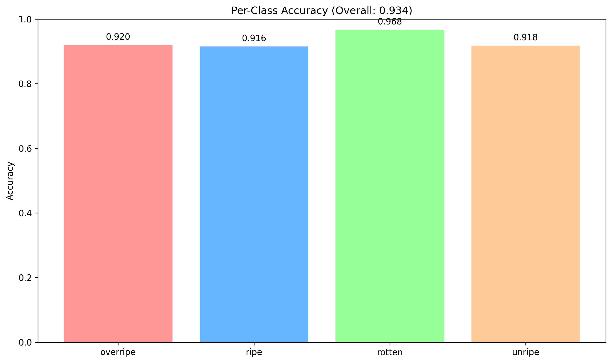
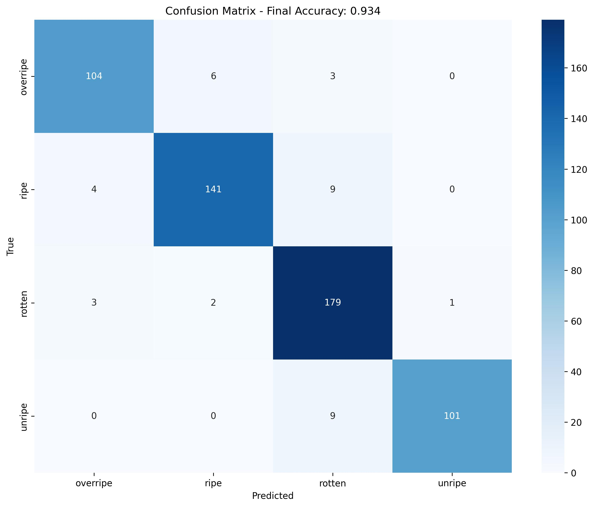

# 🍌 Banana Ripeness Classification System

A complete AI-powered solution for classifying banana ripeness stages using deep learning with EfficientNet architecture. This project provides both a training pipeline and a production-ready FastAPI service for real-time banana classification.


## 🎯 Project Overview

This system can accurately classify bananas into four ripeness categories:
- **🟢 Unripe**: Not yet ready to eat
- **🟡 Ripe**: Perfect for eating
- **🟤 Overripe**: Past optimal ripeness but still edible
- **⚫ Rotten**: Spoiled and not edible

## 🏆 Model Performance

### Current Model Accuracy: **93.4%**

#### Per-Class Accuracy:


- **Rotten**: 96.8% accuracy
- **Unripe**: 91.8% accuracy  
- **Overripe**: 92.0% accuracy
- **Ripe**: 91.6% accuracy

#### Confusion Matrix:


The confusion matrix shows excellent performance with minimal misclassifications between classes, demonstrating the model's reliability in real-world scenarios.

## 🚀 Quick Start - Using Pre-trained Model

### 1. Clone & Setup
```bash
git clone <your-repo-url>
cd banana-classification
pip install -r requirements.txt
```

### 2. Project Structure
```
banana-classification/
├── .github/
│   └── workflows/
│       └── CI.yaml                  # GitHub Actions workflow
├── model/
│   ├── banana_model_FINAL.keras     # Pre-trained model (93.4% accuracy)
│   ├── final_confusion_matrix.jpg   # Model performance visualization
│   └── per_class_accuracy.jpg       # Per-class accuracy chart
├── app.py                          # FastAPI web service
├── train_model.py                  # Complete training pipeline
├── requirements.txt                # Python dependencies
├── .gitignore                      # Git ignore rules
└── README.md                       # This documentation
```

### 3. Start the API Service
```bash
python app.py
```
🌐 **Access Points:**
- API Documentation: http://localhost:8000/docs
- Health Check: http://localhost:8000/health
- Model Info: http://localhost:8000/model/info

## 🔧 Training Your Own Model

### Prerequisites - Download Dataset
Before training, you need to download the banana classification dataset:

1. **Download from Kaggle**: https://www.kaggle.com/datasets/atrithakar/banana-classification
2. **Extract** the dataset to create a `dataset/` folder in your project root
3. **Ensure** the following structure:

```
banana-classification/
├── dataset/                        # Download from Kaggle link above
│   ├── train/
│   │   ├── unripe/
│   │   ├── ripe/
│   │   ├── overripe/
│   │   └── rotten/
│   ├── valid/
│   │   ├── unripe/
│   │   ├── ripe/
│   │   ├── overripe/
│   │   └── rotten/
│   └── test/
│       ├── unripe/
│       ├── ripe/
│       ├── overripe/
│       └── rotten/
├── model/
├── app.py
├── train_model.py
└── requirements.txt
```

### Training Commands
```bash
# Install dependencies
pip install -r requirements.txt

# Download dataset from Kaggle (required!)
# https://www.kaggle.com/datasets/atrithakar/banana-classification
# Extract to dataset/ folder

# Verify dataset structure
ls dataset/train/  # Should show: unripe ripe overripe rotten

# Start training
python train_model.py
```

### Training Features:
- **Transfer Learning**: Uses pre-trained EfficientNetB0
- **Data Augmentation**: Rotation, flip, zoom, contrast adjustments  
- **Smart Callbacks**: Early stopping, learning rate reduction
- **Fine-tuning**: Unfreezes top layers for better performance
- **Automatic Saving**: Best model saved automatically to `model/` directory

### Expected Training Time:
- **Initial Training**: ~15-20 epochs (10-15 minutes on GPU)
- **Fine-tuning**: ~5-8 epochs (5-8 minutes on GPU)
- **Total Time**: ~20-25 minutes on modern GPU

## 📡 FastAPI Service Usage

### Available Endpoints

#### 🏠 Root Information
```bash
GET /
# Returns API overview and available endpoints
```

#### 💚 Health Check
```bash
GET /health
# Returns server status and model loading status
```

#### 🤖 Model Information
```bash
GET /model/info
# Returns detailed model architecture and parameters
```

#### 🔍 Single Image Prediction
```bash
POST /predict
Content-Type: multipart/form-data

curl -X POST "http://localhost:8000/predict" -F "file=@banana_image.jpg"
```

**Response:**
```json
{
  "success": true,
  "prediction": {
    "class": "ripe",
    "confidence": 0.94,
    "class_index": 1
  },
  "all_probabilities": {
    "unripe": 0.02,
    "ripe": 0.94,
    "overripe": 0.03,
    "rotten": 0.01
  },
  "metadata": {
    "filename": "banana_image.jpg",
    "processed_size": [224, 224],
    "timestamp": "2025-09-06T16:30:00"
  }
}
```

#### 📦 Batch Prediction
```bash
POST /predict/batch
# Upload multiple images at once (max 10)
```

### Testing the API

#### Using the Web Interface:
1. Visit http://localhost:8000/docs
2. Click on `/predict` endpoint
3. Upload your banana image
4. Get instant results!

#### Using cURL:
```bash
# Single prediction
curl -X POST "http://localhost:8000/predict" -F "file=@your_banana.jpg"

# Health check
curl http://localhost:8000/health

# Model info
curl http://localhost:8000/model/info
```

## 🎁 Key Benefits & Features

### 🧠 **Advanced AI Capabilities**
- **High Accuracy**: 93.4% overall accuracy across all classes
- **Balanced Performance**: Consistent accuracy across all ripeness stages
- **Transfer Learning**: Leverages pre-trained EfficientNet knowledge
- **Robust Preprocessing**: Handles various image formats and sizes
- **Real-time Inference**: Fast predictions (< 100ms per image)

### 🚀 **Production-Ready API**
- **RESTful Design**: Standard HTTP endpoints
- **Interactive Docs**: Built-in Swagger UI documentation
- **Batch Processing**: Handle multiple images simultaneously
- **Error Handling**: Comprehensive error responses
- **CORS Support**: Ready for web integration
- **Health Monitoring**: Built-in health checks

### 🛠️ **Developer-Friendly**
- **Easy Setup**: Simple pip install requirements
- **Well-Documented**: Comprehensive code comments and README
- **Modular Design**: Separate training and inference code
- **Extensible**: Easy to add new classes or features
- **CI/CD Ready**: GitHub Actions workflow included

### 🔧 **Deployment Ready**
- **Docker Compatible**: Easy containerization
- **Cloud Ready**: Works on AWS, GCP, Azure
- **Scalable**: Can handle concurrent requests
- **Monitoring**: Built-in health checks and logging

## 🏗️ Technical Architecture

### Model Architecture:
```
Input (224x224x3)
    ↓
Data Augmentation Layer
    ↓
EfficientNetB0 (Frozen)
    ↓
Global Average Pooling
    ↓
Dropout (0.3)
    ↓
Dense (4 classes, Softmax)
    ↓
Output Probabilities
```

### Technology Stack:
- **Deep Learning**: TensorFlow 2.16+
- **Architecture**: EfficientNetB0 with transfer learning
- **API Framework**: FastAPI with async support
- **Image Processing**: Pillow (PIL)
- **Data Handling**: NumPy
- **Visualization**: Matplotlib, Seaborn

## 📊 Performance Analysis

### Model Strengths:
- **Excellent Rotten Detection**: 96.8% accuracy - critical for food safety
- **Reliable Unripe Detection**: 91.8% accuracy for premature bananas
- **Consistent Performance**: All classes achieve >90% accuracy
- **Minimal Confusion**: Clean separation between ripeness stages
- **Fast Inference**: Suitable for real-time applications

### Real-World Applications:
- **Grocery Stores**: Automated quality assessment and sorting
- **Food Apps**: Smart recipe recommendations based on ripeness
- **Supply Chain**: Quality control in banana distribution and logistics
- **Smart Kitchens**: IoT integration for food freshness monitoring
- **Research**: Agricultural studies and food waste reduction

## 🔧 System Requirements

### Minimum Requirements:
- **Python**: 3.8 or higher
- **RAM**: 4GB (8GB recommended)
- **Storage**: 3GB free space (including dataset)
- **CPU**: Any modern processor

### Recommended for Training:
- **GPU**: NVIDIA GPU with CUDA support (GTX 1060 or better)
- **RAM**: 16GB or higher
- **Storage**: SSD recommended for faster data loading

### Dataset Requirements:
- **Download Size**: ~500MB (compressed)
- **Extracted Size**: ~1.2GB
- **Images**: ~3000+ banana images across 4 classes
- **Source**: Kaggle - high-quality, labeled dataset

## 📝 File Descriptions

| File/Folder | Description |
|-------------|-------------|
| `app.py` | FastAPI web service with all endpoints |
| `train_model.py` | Complete training pipeline with fine-tuning |
| `requirements.txt` | All Python dependencies |
| `model/banana_model_FINAL.keras` | Pre-trained model (93.4% accuracy) |
| `model/final_confusion_matrix.jpg` | Detailed confusion matrix visualization |
| `model/per_class_accuracy.jpg` | Per-class accuracy comparison chart |
| `.github/workflows/CI.yaml` | GitHub Actions continuous integration |
| `.gitignore` | Git ignore rules for Python projects |
| `dataset/` | ⚠️ **Must download separately from Kaggle** |

## 🤝 Contributing

We welcome contributions! Here's how to get started:

1. **Fork** the repository
2. **Download** the dataset from the Kaggle link above
3. **Create** a feature branch: `git checkout -b feature-name`
4. **Test** your changes with the dataset
5. **Commit** changes: `git commit -am 'Add feature'`
6. **Push** to branch: `git push origin feature-name`
7. **Submit** a Pull Request

### Development Setup:
```bash
# Clone your fork
git clone https://github.com/yourusername/banana-classification.git

# Install dependencies
pip install -r requirements.txt

# Download dataset to dataset/ folder
# https://www.kaggle.com/datasets/atrithakar/banana-classification

# Test the setup
python app.py
```
``

## 📊 Dataset Information

**Dataset Source**: [Banana Classification - Kaggle](https://www.kaggle.com/datasets/atrithakar/banana-classification)

### Dataset Statistics:
- **Total Images**: ~3,000+ high-quality banana images
- **Classes**: 4 (Unripe, Ripe, Overripe, Rotten)
- **Image Format**: JPG/JPEG
- **Resolution**: Various (automatically resized to 224x224)
- **Train/Valid/Test Split**: Pre-organized for immediate use

### Data Quality:
- ✅ **High Resolution**: Clear, detailed images
- ✅ **Diverse Conditions**: Various lighting and backgrounds
- ✅ **Balanced Classes**: Roughly equal samples per class
- ✅ **Quality Labeled**: Manually verified classifications

## 📞 Support & Contact

For issues, questions, or contributions:
- 📧 **Email**: tishyachauhan07@gmail.com
- 🐛 **Bug Reports**: Use GitHub Issues
- 💡 **Feature Requests**: Use GitHub Discussions
- 📚 **Documentation**: Check this README first

### Quick Links:
- [Dataset Download](https://www.kaggle.com/datasets/atrithakar/banana-classification) 
- [API Documentation](http://localhost:8000/docs) (when running)
- [Model Performance Charts](model/)

---

**Made with 🍌 and ❤️ by Tishya**

*Last updated: September 6, 2025*

> **Important**: Don't forget to download the dataset from Kaggle before training! The model training requires the dataset to be placed in the `dataset/` folder as shown in the project structure above.